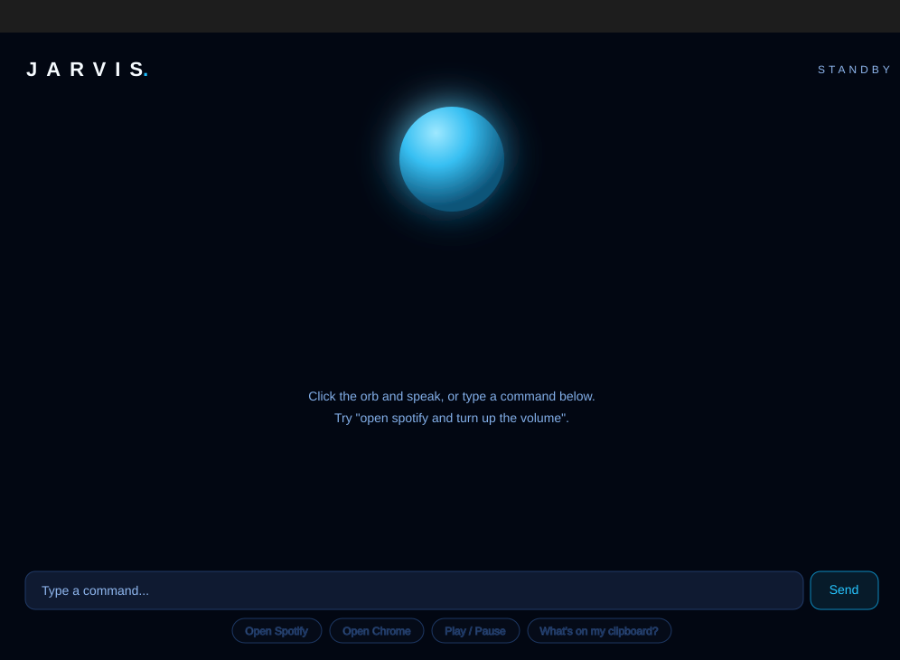
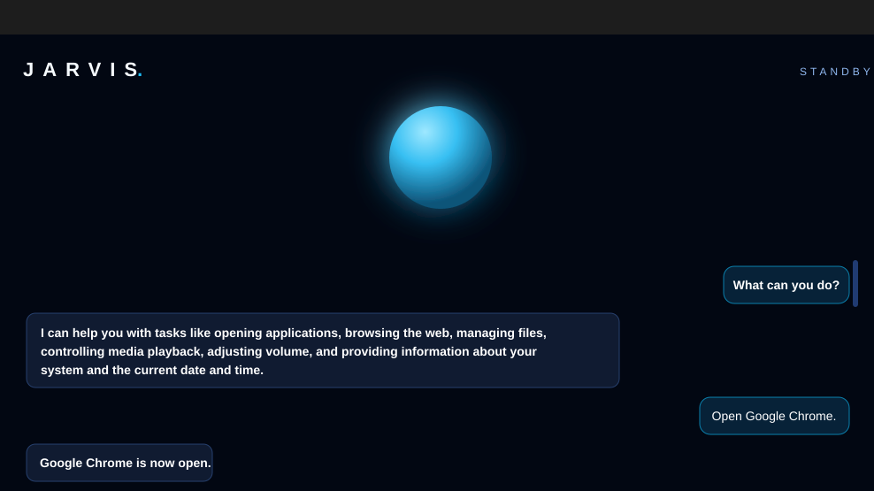
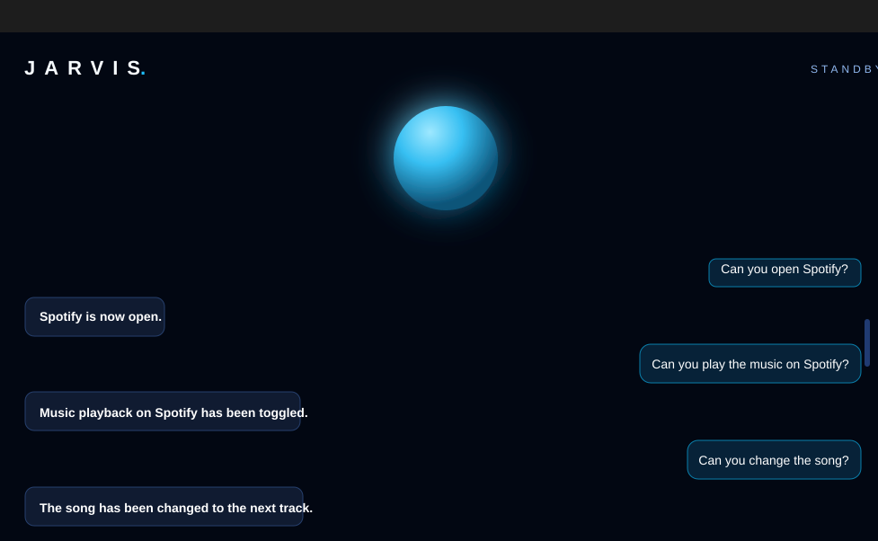
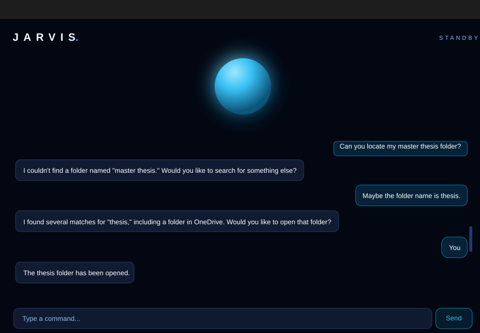

# Jarvis

Jarvis is a desktop AI assistant for controlling everyday computer tasks with typed or spoken natural language commands.

It combines a Tauri desktop shell, a React command UI, Rust system integrations, and a TypeScript tool-calling agent backed by OpenAI.

## Screenshots

<p>
  
  
</p>

<p>
  
  
</p>

## What It Can Do

- Launch supported desktop apps: Spotify, Chrome, Edge, Notepad, Calculator, VS Code, File Explorer, Terminal, and Settings.
- Open websites in the default browser.
- Control media playback with play/pause, next track, and previous track.
- Adjust system volume.
- Read and write clipboard text.
- Answer date, time, and system information questions.
- Search for files and folders in the user's home directory.
- List the contents of a folder.
- Open files or folders with their default application.
- Create, copy, move, read, write, append, and delete files within guarded filesystem boundaries.
- Lock the screen, sleep, shut down, or restart the computer.
- Minimize all windows to show the desktop.
- Play a requested song — in the Spotify app when installed and connected, otherwise on YouTube.
- Report the current weather (via wttr.in, no API key needed).
- Read out the latest news headlines (via Google News RSS).
- Take dictated notes in `Documents/jarvis-notes.txt` and read them back.
- Run a "workshop entrance" when told "let's get to work" or "I'm back": plays Highway to Hell, then greets you with a weather, notes, and news briefing and suggests what to start on.
- Ask for confirmation before destructive or high-impact actions such as deleting files or shutting down.

## How It Works

Jarvis keeps a short conversation history and sends each user turn to OpenAI with a registry of available tools. The model selects one or more tools, the TypeScript registry validates the tool name and arguments, and the matching action runs through the desktop backend.

The desktop app is split into three layers:

- `apps/desktop`: Tauri 2 + React app, including the orb UI, chat log, command composer, and Rust commands.
- `packages/core`: The Jarvis agent loop, conversation memory, OpenAI tool selection, and confirmation flow.
- `packages/tools` and `packages/actions`: Tool schemas, argument validation, and implementations for apps, URLs, clipboard, media, datetime, system info, and files.

## Tech Stack

- Tauri 2 for the desktop shell and OS bridge.
- React 18 and TypeScript for the UI.
- Rust for system, file, input, clipboard, and command execution.
- OpenAI chat completions with function tools for command understanding.
- Vite for frontend development.

## Project Structure

```text
jarvis/
  apps/
    desktop/
      src/              React UI and Jarvis hook
      src-tauri/        Tauri/Rust backend
  packages/
    actions/            TypeScript action wrappers
    core/               Agent loop and model/tool orchestration
    openai/             OpenAI client
    shared/             Shared argument and tool types
    tools/              Tool registry, schemas, and validation
    voice/              Audio, STT, TTS, and VAD modules
    wakeword/           Wake-word detector module
```

## Local Development

Install dependencies:

```bash
npm install
```

Create `apps/desktop/.env`:

```env
OPENAI_API_KEY=replace_with_your_key
OPENAI_MODEL=gpt-4o-mini
# Optional: enables playback in the Spotify app (see Spotify Playback below)
SPOTIFY_CLIENT_ID=replace_with_your_spotify_client_id
```

Run the desktop app:

```bash
npm run dev
```

Build the desktop app:

```bash
npm run build
```

Type-check the project:

```bash
npm run typecheck
```

## Configuration Notes

The OpenAI request is handled by the Rust backend in `apps/desktop/src-tauri`. The frontend talks to the backend through Tauri `invoke()` calls, so the OpenAI key should stay in `apps/desktop/.env` and should not be exposed through `VITE_` environment variables.

The current agent model is configured in `packages/core/agent.ts`. Tool execution is capped per user turn to avoid runaway action loops.

## Spotify Playback (Optional)

Without any setup, "play a song" opens the best YouTube match in the browser. To play songs in the Spotify desktop app instead:

1. Create an app at <https://developer.spotify.com/dashboard> (any name works).
2. In the app settings, add `http://127.0.0.1:8898/callback` as a redirect URI.
3. Copy the app's Client ID into `SPOTIFY_CLIENT_ID` in `apps/desktop/.env`.
4. Say "Jarvis, connect Spotify" and approve the browser prompt once.

The refresh token is stored in the OS config directory (`%APPDATA%\jarvis` on Windows), never in the frontend. Starting playback through the Spotify Web API requires Spotify Premium; on free accounts Jarvis automatically falls back to YouTube.

## Safety Boundaries

Jarvis validates every model-selected tool call against the local registry before execution. File actions are scoped to the user's home directory, and destructive operations such as moving files to the recycle bin require confirmation before they run.

## Status

This is an early personal assistant prototype. The command UI, tool registry, OpenAI agent loop, and core desktop actions are implemented. Voice, wake-word, and richer automation modules are present in the package layout and are still evolving.
